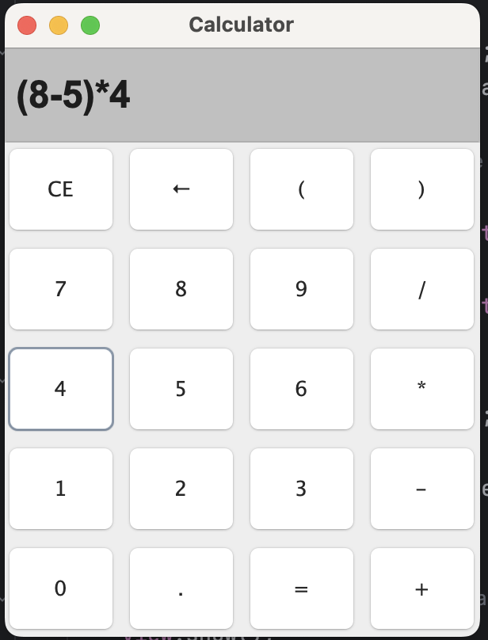
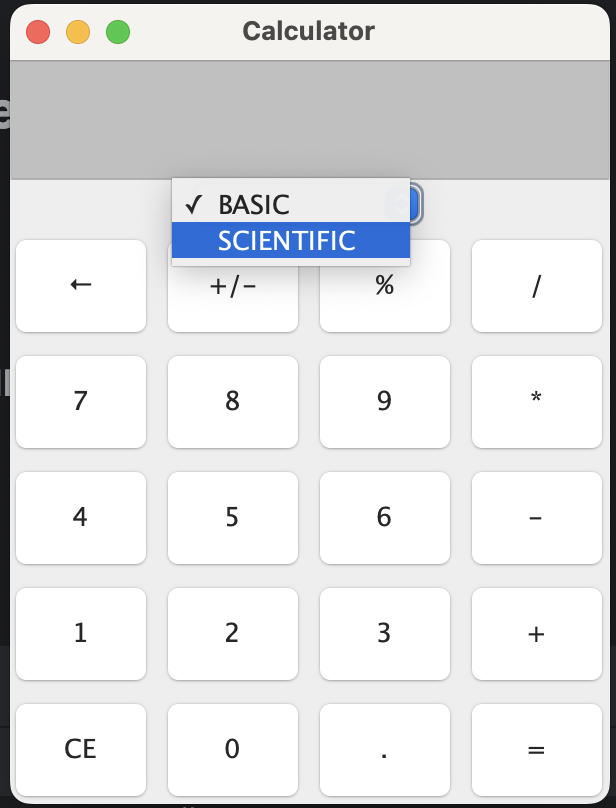
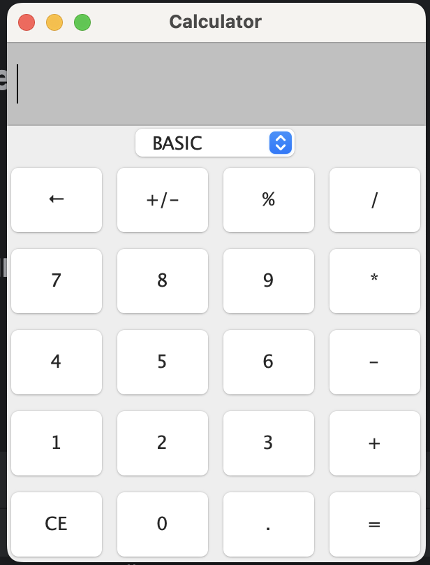
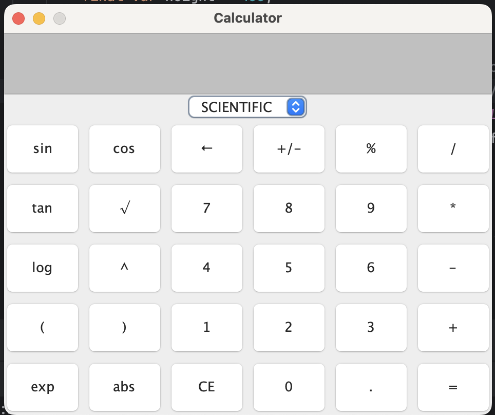

# Mini Calculator

This project is a basic calculator with a GUI interface to exercise TDD, Object Oriented Programming and learning more
GUI programming with Java and AWT library.

## Features

* Infix basic mathematical expression parsing and evaluation (e.g.: `((5 - 2) / 3) * 1.5`)
* Supported operators: `+`, `-`, `*`, `/`, `%`, `√`
* Supported numbers set: `Real Numbers`
* Supported modes: `Basic` and `Scientific`

### WIP

* Calculator modules:
    * Scientific - trigonometry

## Example

### Modes

### Basic

### Scientific

