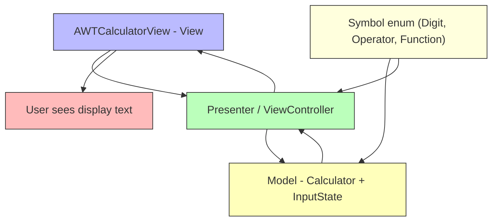
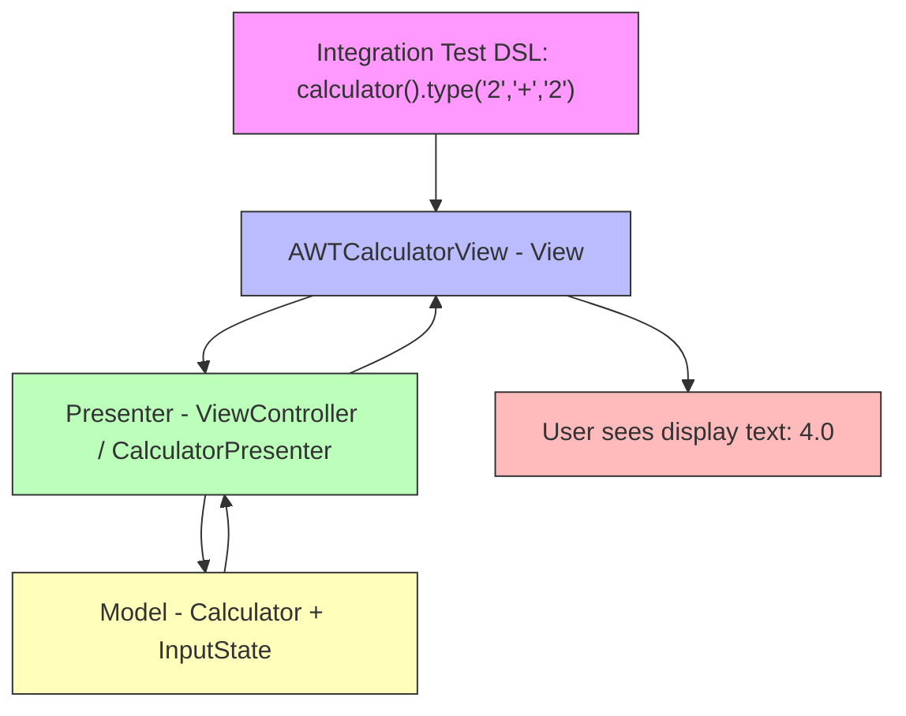

# Mini Calculator

This project is a basic calculator with a GUI interface to exercise TDD, Object Oriented Programming and learning more
GUI programming with Java and AWT library.

## Features

* Infix basic mathematical expression parsing and evaluation (e.g.: `((5 - 2) / 3) * 1.5`)
* Supported operators: `+`, `-`, `*`, `/`, `%`, `√`
* Supported numbers set: `Real Numbers`
* Supported modes: `Basic` and `Scientific`

## Architectural Patterns

* [Modular Monolith](https://medium.com/design-microservices-architecture-with-patterns/microservices-killer-modular-monolithic-architecture-ac83814f6862)
  for the project overall structure
* [Model-View-Presenter](https://www.geeksforgeeks.org/android/mvp-model-view-presenter-architecture-pattern-in-android-with-example/)
  for the UI

### Diagram

### WIP

* Calculator modules:
    * Scientific - trigonometry

## Images

### Modes

### Basic

### Scientific

## Integration Tests Using DSL

